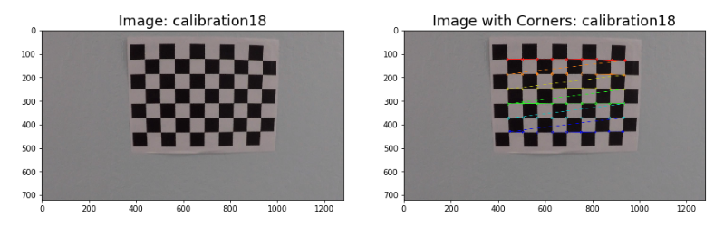
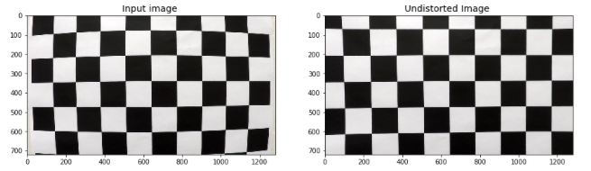
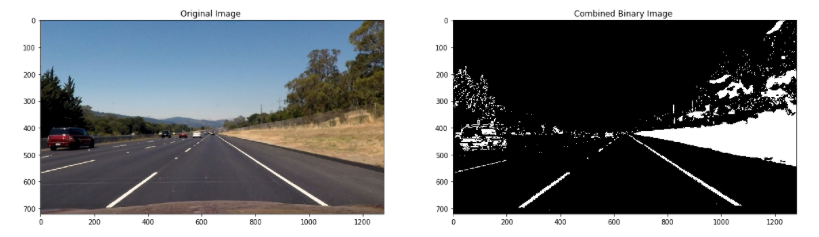
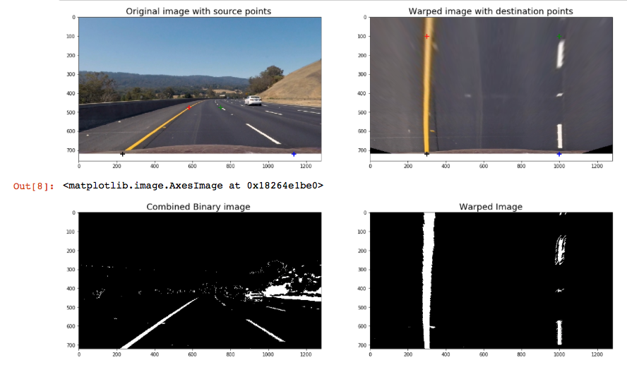
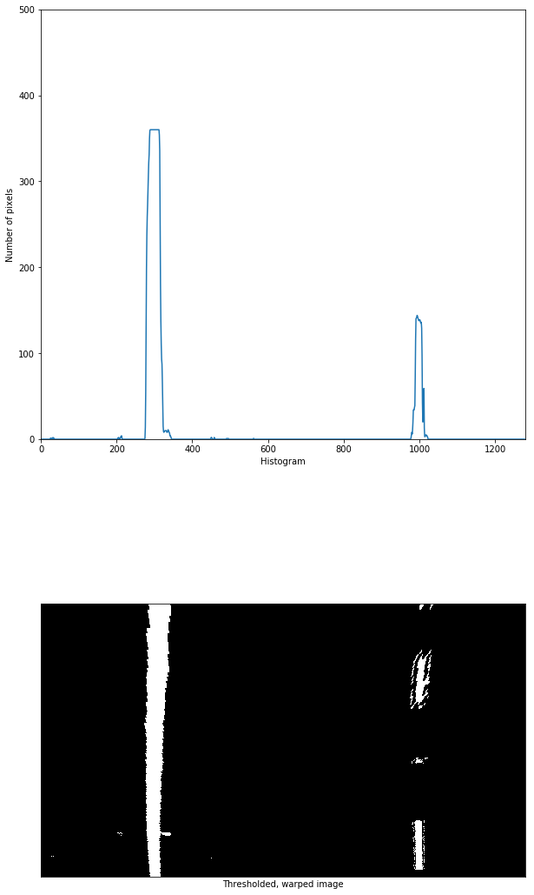
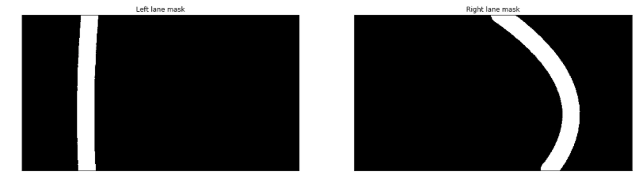
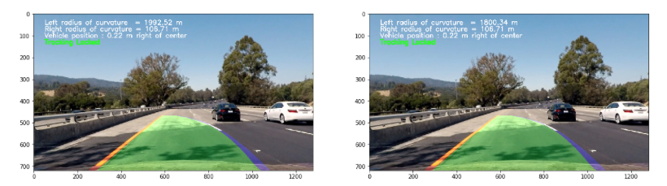

## Writeup 


---

**Advanced Lane Finding Project**

The goals / steps of this project are the following:

* Compute the camera calibration matrix and distortion coefficients given a set of chessboard images.
* Apply a distortion correction to raw images.
* Use color transforms, gradients, etc., to create a thresholded binary image.
* Apply a perspective transform to rectify binary image ("birds-eye view").
* Detect lane pixels and fit to find the lane boundary.
* Determine the curvature of the lane and vehicle position with respect to center.
* Warp the detected lane boundaries back onto the original image.
* Output visual display of the lane boundaries and numerical estimation of lane curvature and vehicle position.

[//]: # (Image References)

[image1]: ./examples/undistort_output.png "Undistorted"
[image2]: ./test_images/test1.jpg "Road Transformed"
[image3]: ./examples/binary_combo_example.jpg "Binary Example"
[image4]: ./examples/warped_straight_lines.jpg "Warp Example"
[image5]: ./examples/color_fit_lines.jpg "Fit Visual"
[image6]: ./examples/example_output.jpg "Output"
[video1]: ./project_video.mp4 "Video"

## [Rubric](https://review.udacity.com/#!/rubrics/571/view) Points

### Here I will consider the rubric points individually and describe how I addressed each point in my implementation.  

---

### Writeup / README

#### 1. Provide a Writeup / README that includes all the rubric points and how you addressed each one.  You can submit your writeup as markdown or pdf.  [Here](https://github.com/udacity/CarND-Advanced-Lane-Lines/blob/master/writeup_template.md) is a template writeup for this project you can use as a guide and a starting point.  

You're reading it!

### Camera Calibration

#### 1. Briefly state how you computed the camera matrix and distortion coefficients. Provide an example of a distortion corrected calibration image.

The first step in the pipeline is camera caliberation. I used OpenCV ```findChessboardCorners``` function to find the corners and append them to image-points which represents the 2D points in the image. I also prepared simultaneiusly object points (x,y,z) which represent the 3D coordinatres of the chessboard corners in the world. To do this I assumed that the chessboard is fixed on an (x,y) plane at z=0, s.t. the object points for all caliberation images are same.

I then used the object points and image points returned by the camera_caliberation function to compute the camera calibration and distortion coefficients with the help of OpenCV's ```calibrateCamera``` function. 


The code for this step is contained in the second code cell of the IPython notebook ```Adv_Lane_Line_detection.ipynb```.  The image below shows one of the image used for calibration alongwith the corners drawn on it after detection.



### Pipeline (single images)

#### 1. Provide an example of a distortion-corrected image.

After the camera is calibrated we proceed with our pipeline. As the first step we use the camera intrinsic and extrinsic features to undistort the provided image. For this I made a function ``` undistort()``` . The OpenCV ```cv2.undistort(img, mtx, dist, None, mtx)``` function is used for undistorting the image, it takes in the camera matrix and distance. The image below is the result of our undistort functions. 


#### 2. Describe how (and identify where in your code) you used color transforms, gradients or other methods to create a thresholded binary image.  Provide an example of a binary image result.

The second step in pipeline was to make a thresholded binary image. I used a combination of four color and gradient thresholds to generate a binary image:

* _X Gradient_: for this I used the x-gradient found using the sobel filter. This is ensure that I get vertical left and right lanes. The gradient between [50,100] range is selected.

* _'S' Channel from HLS color space_: The HLS color space is good to identify both white and yellow lines. However it was not very good in shadow regions of the road. The threshold range is [180, 255]

* _'L' Channel from LUV color space_: For the challenge video the HLS was not sufficient so I used LUV color space for better detecting the right white lane. The threshold range is [210, 255].

* _'B' channel from the LAB color space_: This color space helped me to identify the dull yellow left lane . The threshold range is [150, 200]

The function is defined in the cell 6. Here's an example of my output for this step.  



#### 3. Describe how (and identify where in your code) you performed a perspective transform and provide an example of a transformed image.

To find the perspective we need to find the points in the source and corresponding points in destination image. One way is to hard-code the. But the programm would be much more interactive if perspective points can be automatically. The function ```find_perspective_points(image)``` calculates the src points. I use the code we learned earlier to detect lines in ROI, and find the intersection of lines and use the equation of the line to find the source image points. The destination points are hard coded. 
```
dst = np.array([[300. /1280.*img_size[1], 100./720.*img_size[0]],
                        [1000./1280.*img_size[1], 100./720.*img_size[0]],
                        [1000./1280.*img_size[1], 720./720.*img_size[0]],
                        [300. /1280.*img_size[1], 720./720.*img_size[0]]], np.float32)
```


In the same cell (cell number 7) I later calculate the perspective transform. The result is shows the perspective transform is working, the warped image shows parrallel lines:





The image on top is the result of ```find_perspective_points()``` function. It takes the original undistorted image. The source points obtained from it are used to find the bird eye view by the ```get_perspective_transform(image, src_in = None, display=False)``` function.


#### 4. Describe how (and identify where in your code) you identified lane-line pixels and fit their positions with a polynomial?

To detect the lanes I used two methods -- histogram and masking method. Masking method is good when we have a prior knowledge about the location of the lane lines. The methods are defined in the cell 9 along with class object ```Line``` which I have adpated from the class lectures. 

##### (a) Histogram Method

As the first step we compute the base points of the lanes. This is done in the ```find_base_points``` function defined in the cell 11. We compute a histogram of the lower half of the thresholded image. The histogram along with  corresponding thresholded warped image is shown below:



I use the `find_peaks_cwt` function of scikit Learn to identify the peaks in the histogram. The indices thus obtained are further filtered to reject any value below a certain minimum, also any peaks very close to the edges of the image are filtered out. 

Once the base points are found, I use a sliding window method is used to extract the lane pixels, the code of sliding windows is defined in the ```histogram_lane_detection``` function in cell 9. The algorithm splits the image into a number of horizontal windows (default value 10). We start at the lowest band, a window of a fixed width centered at both base points is considered. The x and y coordinates of all the nonzero pixels in these windows are compiled into into separate lists. The base point for the next band is assumed to be the column with the maximum number of pixels in the current band. Once all the points are accumulated we use the function ```reject_outliers``` to remove any points with x or y coordinates outside the twice of standard deviations from the mean value. This helps to remove the irrelevant pixels from the data.

These filtered pixels are then passed into the ```add_lane_pixels``` method of the `Line` class. These pixels, along with a weighted average of prior lane pixels are used with numpy's ```polyfit``` function to compute a second order polynomial that fits the points. from this polyonomial we then create an image mask specifying the ROI, this is used by the masking method for the upcoming frames.

##### (b) Masking Method

This method is computationally less expensive, and is used when a lane has already been detected. It is defined as a class method of class Line.  The previously detected lanes are used to define regions of interest. The function uses the mask generated during the histogram method to remove irrelevant pixels and then uses all non-zero pixels found in ROI with the ```add_lane_pixels``` method to compute the polynomial describing the lane.



As suggested in lectures I use a __sanity check__ based on the radius of curvature of the lanes to assess the results of lane detection. If two many frames fail the sanity check, the algorithm reverts to the histogram method until the lane is detected again. If the sanity check fails, the frame is considered to be a "dropped frame" and the previously calculated lane curve is used. If more than 15 frames are  dropped then algorithm switches back to the histogram method.


#### 5. Describe how (and identify where in your code) you calculated the radius of curvature of the lane and the position of the vehicle with respect to center.

```compute_rad_curv``` static method of the Line class calculates the radius of curvature. The pixel values of the lane are then scaled into meters using the scaling factors:

```
ym_per_pix = 30/720 # meters per pixel in y dimension
xm_per_pix = 3.7/700 # meteres per pixel in x dimension
```
Using these values and expressions given in class I calculate the radius of curvature. 

To compute the position of the vehicle, we assume that the camera is at the center of the vehicle. The code to calculate vehicle position is calculated in the function ```process_image``` defined in cell 12. The code is reproduced below:

```
middle = (left_fitx[-1] + right_fitx[-1])//2
veh_pos = image.shape[1]//2
dx = (veh_pos - middle)*xm_per_pix # Positive on right, Negative on left
```


#### 6. Provide an example image of your result plotted back down onto the road such that the lane area is identified clearly.

The complete pipeline is implemented in the function ```process_image``` defined in cell 12.  The figure below lists the result after the complete pipeline is implemented


---

### Pipeline (video)

#### 1. Provide a link to your final video output.  Your pipeline should perform reasonably well on the entire project video (wobbly lines are ok but no catastrophic failures that would cause the car to drive off the road!).

Here's a [link to my video result](./project_video.mp4). You can also see the video on YouTube [here](https://youtu.be/ZEA218KhLP0). I tried it on the challenge video as well. The results were not bad but I had to include more filters to get combined binary threshold so that it can capture the dull yellow lanes. The final result is in the [video](./challenge_video_out.mp4), and [YouTube Link](https://youtu.be/IEiQraBog9w).

I tried the harder challenge but it had some very sharp curves, result was not very good. 

---

### Discussion

#### 1. Briefly discuss any problems / issues you faced in your implementation of this project.  Where will your pipeline likely fail?  What could you do to make it more robust?

The pipeline works well for the simple and hard project video, but not so well on harder project video, the sharp curves in it make the task difficult. 

To make it more robust We need an algorithm which can detect edges/lanes even at sharp angles. McCall, J. C., & Trivedi, M. M. (2006) in there paper [Video-based lane estimation and tracking for driver assistance: survey, system, and evaluation.](http://escholarship.org/uc/item/1bg5f8qd) proposed Steerable filters, we can try them.
Instead of straight line detection we can have a polynomial of second degree fit for lane detection.


